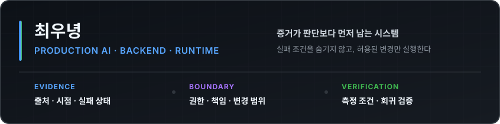

  

  
  
  

## 대표 프로젝트

  
  
  
  

  <a href="https://github.com/woonyong-kr/k8s-ops/blob/main/docs/GOLDEN-PATH.md">Kyro 설계</a> ·
  <a href="https://github.com/woonyong-kr/minidb/blob/main/docs/benchmark-postgres.md">MiniDB 벤치마크</a> ·
  <a href="https://github.com/woonyong-kr/pintos/tree/main/docs/pintos">PintOS 구현 기록</a> ·
  <a href="https://github.com/woonyong-kr/dx_framework#코드-지도">JFramework 코드 지도</a>

## 공개 저장소 상태

<!-- repository_health:start -->
| 저장소 | 상태 | 주 언어 | 검증 | 최근 변경 |
|---|---|---|---|---|
| [Kyro](https://github.com/woonyong-kr/k8s-ops) |  | Python | Backend 203 tests | [fix: 평가로 찾은 규칙 판별 결함 5건 개선](https://github.com/woonyong-kr/k8s-ops/commit/8c9e546fece4345fbac01c07c3d71f49c9b1da46) |
| [MiniDB](https://github.com/woonyong-kr/minidb) |  | C | 224/224 tests | [build: sanitizer 선택 / 224개 테스트 / CI 게이트](https://github.com/woonyong-kr/minidb/commit/7b7c43ff93e350a8feecc6d049d4e8e2828937bc) |
| [PintOS](https://github.com/woonyong-kr/pintos) |  | C++ | 141/141 CI | [fix: 실제 우선순위 선점 / 141개 회귀 검증 / checkout v6](https://github.com/woonyong-kr/pintos/commit/ea154f87730d9d3ac492bb234166382ca3531493) |
| [JFramework](https://github.com/woonyong-kr/dx_framework) |  | C# | Coroutine contracts | [test: 코루틴 계약 / 독립 실행 / CI 게이트](https://github.com/woonyong-kr/dx_framework/commit/78c917a276b69c8746dcfb73c08803f698798ab9) |
| [Jekyll Theme](https://github.com/woonyong-kr/jekyll-theme-velog) |  | HTML | MIT · Public template | [fix: Pages canonical URL / 배포 경로 재현 / SEO 검증](https://github.com/woonyong-kr/jekyll-theme-velog/commit/927e76eb627b391354879342b477d64013c54cdd) |
<!-- repository_health:end -->
## 협업 저장소 기여

<!-- collaboration:start -->
- **Jungle-303-04/demo-game** · [fix: pin working admission toggle console](https://github.com/Jungle-303-04/demo-game/pull/22) · 2026-07-25
- **Jungle-303-04/demo-game** · [[복구] api-server - 로비 replicas 원복 PR](https://github.com/Jungle-303-04/demo-game/pull/21) · 2026-07-24
- **Jungle-303-04/demo-game** · [perf: 게임 파드 예약량 / 게임 노드 용량 / 스케줄링 여유](https://github.com/Jungle-303-04/demo-game/pull/20) · 2026-07-24
- **Jungle-303-04/final** · [fix: AI 입력창 고정 / 패널 스크롤 경계 / viewport 높이](https://github.com/Jungle-303-04/final/pull/662) · 2026-07-24
- **Jungle-303-04/final** · [파드 상세 원인 표시와 사이드 패널 UX 통합](https://github.com/Jungle-303-04/final/pull/661) · 2026-07-24
- **Jungle-303-04/final** · [fix: 위험 파드 클릭을 리소스 상세로 연결](https://github.com/Jungle-303-04/final/pull/660) · 2026-07-24
<!-- collaboration:end -->
## 최근 공개 작업

<!-- recent_work:start -->
- **Jekyll Theme** · [fix: Pages canonical URL / 배포 경로 재현 / SEO 검증](https://github.com/woonyong-kr/jekyll-theme-velog/commit/927e76eb627b391354879342b477d64013c54cdd) · 2026-08-03
- **Jekyll Theme** · [feat: 공식 Pages 배포 / 템플릿 검증 / 설정 하드코딩 제거](https://github.com/woonyong-kr/jekyll-theme-velog/commit/df36b865b4079574f6ee6bc8e6fed4bbb7f81441) · 2026-08-03
- **PintOS** · [fix: 실제 우선순위 선점 / 141개 회귀 검증 / checkout v6](https://github.com/woonyong-kr/pintos/commit/ea154f87730d9d3ac492bb234166382ca3531493) · 2026-08-03
- **PintOS** · [fix: MLFQS 고정소수점 / 전체 스레드 갱신 / CI 분리](https://github.com/woonyong-kr/pintos/commit/09df7c8e83a5c5a46d0c0b8aa36a3fa7ce59745d) · 2026-08-03
- **JFramework** · [test: 코루틴 계약 / 독립 실행 / CI 게이트](https://github.com/woonyong-kr/dx_framework/commit/78c917a276b69c8746dcfb73c08803f698798ab9) · 2026-08-03
- **JFramework** · [fix: 부모 비활성 판정 / Enum 검색 / 코루틴 정리](https://github.com/woonyong-kr/dx_framework/commit/e622a6115e2d66d587af59e19b7827d5e82286d0) · 2026-08-03
<!-- recent_work:end -->
## 사용하는 오픈소스

**운영·데이터**

**백엔드·런타임**

**자동화·배포**

공개 저장소 상태·커밋·merged PR은 GitHub API에서 매일 수집한다. README에는 최근 항목만 표시하고 최소 메타데이터 원장은 저장소에 누적한다.
