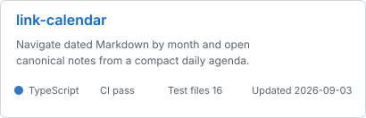
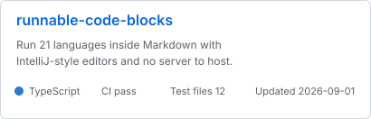
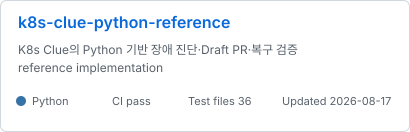

<!-- profile_intro:start -->
# 최우녕

**프로덕션 AI · 런타임 아키텍처 · 쿠버네티스 · 데이터베이스 · 운영체제 · C#/C++**

[블로그](https://woonyong-kr.github.io/#/blog) · [이메일](mailto:woonyong.kr@gmail.com)
<!-- profile_intro:end -->

## 지난 12개월

<!-- activity_summary:start -->

<!-- activity_summary:end -->

## 사용 기술

<!-- technologies:start -->

<!-- technologies:end -->

## 대표 저장소

<!-- project_cards:start -->
자동 선발 · 공개 증거 순위: 본인 커밋 25 · CI 25 · 테스트 구조 15 · 문서 10 · 최근 유지보수 10 · 메타데이터 10 · 공개 반응 5

  
  
   
  
  
   
  
  

<!-- project_cards:end -->

## 검증 상태

<!-- ci_status:start -->
<table width="100%">
  <thead>
    <tr>
      <th align="left">저장소</th>
      <th align="left">기술 범위</th>
      <th align="left">CI</th>
      <th align="right">테스트 파일</th>
      <th align="right">최근 검증</th>
      <th align="right">라이선스</th>
    </tr>
  </thead>
  <tbody>
    <tr>
      <td><a href="https://github.com/woonyong-kr/link-calendar">link-calendar</a></td>
      <td>TypeScript · calendar · knowledge-management</td>
      <td></td>
      <td align="right">16</td>
      <td align="right">2026-09-03</td>
      <td align="right">MIT</td>
    </tr>
    <tr>
      <td><a href="https://github.com/woonyong-kr/runnable-code-blocks">runnable-code-blocks</a></td>
      <td>TypeScript · code-runner · kotlin</td>
      <td></td>
      <td align="right">12</td>
      <td align="right">2026-09-01</td>
      <td align="right">MIT</td>
    </tr>
    <tr>
      <td><a href="https://github.com/woonyong-kr/woon-core">woon-core</a></td>
      <td>Python</td>
      <td></td>
      <td align="right">13</td>
      <td align="right">2026-09-04</td>
      <td align="right">MIT</td>
    </tr>
    <tr>
      <td><a href="https://github.com/woonyong-kr/pintos">pintos</a></td>
      <td>C++ · copy-on-write · operating-system</td>
      <td></td>
      <td align="right">490</td>
      <td align="right">2026-08-26</td>
      <td align="right">—</td>
    </tr>
    <tr>
      <td><a href="https://github.com/woonyong-kr/minidb">minidb</a></td>
      <td>C · b-plus-tree · database</td>
      <td></td>
      <td align="right">5</td>
      <td align="right">2026-08-03</td>
      <td align="right">—</td>
    </tr>
    <tr>
      <td><a href="https://github.com/woonyong-kr/k8s-clue-python-reference">k8s-clue-python-reference</a></td>
      <td>Python · fastapi · gitops</td>
      <td></td>
      <td align="right">36</td>
      <td align="right">2026-08-17</td>
      <td align="right">—</td>
    </tr>
  </tbody>
</table>
<!-- ci_status:end -->

## 최근 공개 작업

<!-- recent_work:start -->
- **linked-graph** · [fix: hide only non-canonical graph destinations](https://github.com/woonyong-kr/linked-graph/commit/06d8d18f37134fac0878095f4ab918b6becae414) · 2026-09-03
- **link-calendar** · [feat: 선택한 일정을 Google Calendar로 안전하게 동기화](https://github.com/woonyong-kr/link-calendar/commit/4575c80b0d4781697beb4dd70c2d726fd2fc4894) · 2026-09-03
- **link-calendar** · [feat: 본문 일정 시간과 표시 형식을 지원](https://github.com/woonyong-kr/link-calendar/commit/2025e60c34c5c3253c4c4b6ea38f4ee1e1d406a5) · 2026-09-02
- **linked-graph** · [fix: resolve graph colour precedence](https://github.com/woonyong-kr/linked-graph/commit/0359a97c62a2b4626f897aef4b6fd4de61d2d556) · 2026-09-01
- **linked-graph** · [fix: prioritize semantic graph colours](https://github.com/woonyong-kr/linked-graph/commit/e71fa2913a7c03c5984f6928baff1493124b52c6) · 2026-09-01
- **linked-graph** · [feat: distinguish graph node kinds by color](https://github.com/woonyong-kr/linked-graph/commit/642a0003dd89561035d86f68a2a22da7ee30b814) · 2026-09-01
<!-- recent_work:end -->

## 외부 저장소 기여

<!-- collaboration:start -->
- **Jungle-303-04/demo-game** · [fix: pin working admission toggle console](https://github.com/Jungle-303-04/demo-game/pull/22) · 2026-07-25
- **Jungle-303-04/demo-game** · [[복구] api-server - 로비 replicas 원복 PR](https://github.com/Jungle-303-04/demo-game/pull/21) · 2026-07-24
- **Jungle-303-04/demo-game** · [perf: 게임 파드 예약량 / 게임 노드 용량 / 스케줄링 여유](https://github.com/Jungle-303-04/demo-game/pull/20) · 2026-07-24
- **Jungle-303-04/final** · [fix: AI 입력창 고정 / 패널 스크롤 경계 / viewport 높이](https://github.com/Jungle-303-04/final/pull/662) · 2026-07-24
- **Jungle-303-04/final** · [파드 상세 원인 표시와 사이드 패널 UX 통합](https://github.com/Jungle-303-04/final/pull/661) · 2026-07-24
- **Jungle-303-04/final** · [fix: 위험 파드 클릭을 리소스 상세로 연결](https://github.com/Jungle-303-04/final/pull/660) · 2026-07-24
<!-- collaboration:end -->

## 최근 글

<!-- recent_posts:start -->
- **프로젝트 · PostgreSQL · NATS** · [DB 는 바뀌었는데 이벤트만 사라질 때](https://woonyong-kr.github.io/blog/transactional-outbox/) · 2026-08-02 Transactional Outbox · 멱등 처리 · DLQ 구현 기록
- **프로젝트 · C++** · [655개 함수와 열 개 회사 사이](https://woonyong-kr.github.io/blog/cli-proxy/) · 2026-08-02 C++/CLI 프록시로 엔진과 콘텐츠의 경계를 고정한 기록
- **회고** · [도구가 아니라 기준이 문제였다](https://woonyong-kr.github.io/blog/team-standard/) · 2026-08-02 노션 도입 실패에서 완료 기준 합의까지, 60명을 한 팀으로 만든 과정
- **프로젝트 · C** · [공유된 페이지는 스왑도 공유한다](https://woonyong-kr.github.io/blog/swap-sharing/) · 2026-08-02 COW 가 만든 두 번째 문제, 슬롯은 누가 언제 반납하나
- **회고** · [열 개 회사의 소스를 한곳으로](https://woonyong-kr.github.io/blog/source-integration/) · 2026-08-02 각자 고치던 엔진을 중앙 관리로 모으고 PM 이 된 과정
- **프로젝트 · Python** · [장애 원인 판정을 YAML로 분리한 이유](https://woonyong-kr.github.io/blog/rule-catalog/) · 2026-08-02 규칙 카탈로그와 합성 회귀 입력이 확인하는 범위
<!-- recent_posts:end -->
