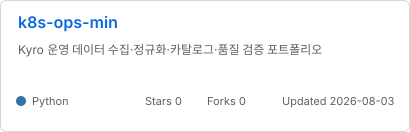

<!-- profile_intro:start -->
# 최우녕

**Production AI · Runtime Architecture · Kubernetes · DB · OS · C#/C++**

[GitHub](https://github.com/woonyong-kr) · [기술 기록](https://woonyong-kr.github.io) · [Email](mailto:woonyong.kr@gmail.com)
<!-- profile_intro:end -->

## 대표 저장소

<!-- project_cards:start -->

  
  
   
  
  
   
  
  

<!-- project_cards:end -->

<!-- ci_status:start -->

<!-- ci_status:end -->

## 협업 저장소 기여

<!-- collaboration:start -->
- **Jungle-303-04/demo-game** · [fix: pin working admission toggle console](https://github.com/Jungle-303-04/demo-game/pull/22) · 2026-07-25
- **Jungle-303-04/demo-game** · [[복구] api-server - 로비 replicas 원복 PR](https://github.com/Jungle-303-04/demo-game/pull/21) · 2026-07-24
- **Jungle-303-04/demo-game** · [perf: 게임 파드 예약량 / 게임 노드 용량 / 스케줄링 여유](https://github.com/Jungle-303-04/demo-game/pull/20) · 2026-07-24
- **Jungle-303-04/final** · [fix: AI 입력창 고정 / 패널 스크롤 경계 / viewport 높이](https://github.com/Jungle-303-04/final/pull/662) · 2026-07-24
- **Jungle-303-04/final** · [파드 상세 원인 표시와 사이드 패널 UX 통합](https://github.com/Jungle-303-04/final/pull/661) · 2026-07-24
- **Jungle-303-04/final** · [fix: 위험 파드 클릭을 리소스 상세로 연결](https://github.com/Jungle-303-04/final/pull/660) · 2026-07-24
<!-- collaboration:end -->

## 최근 공개 작업

<!-- recent_work:start -->
- **jekyll-theme-velog** · [fix: Pages canonical URL / 배포 경로 재현 / SEO 검증](https://github.com/woonyong-kr/jekyll-theme-velog/commit/927e76eb627b391354879342b477d64013c54cdd) · 2026-08-03
- **jekyll-theme-velog** · [feat: 공식 Pages 배포 / 템플릿 검증 / 설정 하드코딩 제거](https://github.com/woonyong-kr/jekyll-theme-velog/commit/df36b865b4079574f6ee6bc8e6fed4bbb7f81441) · 2026-08-03
- **pintos** · [fix: 실제 우선순위 선점 / 141개 회귀 검증 / checkout v6](https://github.com/woonyong-kr/pintos/commit/ea154f87730d9d3ac492bb234166382ca3531493) · 2026-08-03
- **pintos** · [fix: MLFQS 고정소수점 / 전체 스레드 갱신 / CI 분리](https://github.com/woonyong-kr/pintos/commit/09df7c8e83a5c5a46d0c0b8aa36a3fa7ce59745d) · 2026-08-03
- **k8s-ops-min** · [style: payload 계측 코드 / Python 3.13 lint / import 정리](https://github.com/woonyong-kr/k8s-ops-min/commit/854b15d6f91b126473233f2bbd13abf618b4b10b) · 2026-08-03
- **dx_framework** · [test: 코루틴 계약 / 독립 실행 / CI 게이트](https://github.com/woonyong-kr/dx_framework/commit/78c917a276b69c8746dcfb73c08803f698798ab9) · 2026-08-03
<!-- recent_work:end -->

## 사용 기술

<!-- technologies:start -->

<!-- technologies:end -->
