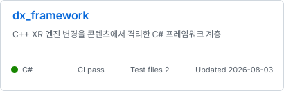
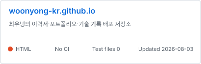

<!-- profile_intro:start -->
# 최우녕

**프로덕션 AI · 런타임 아키텍처 · 쿠버네티스 · 데이터베이스 · 운영체제 · C#/C++**

[블로그](https://woonyong-kr.github.io/#/blog) · [이메일](mailto:woonyong.kr@gmail.com)
<!-- profile_intro:end -->

## 지난 12개월

<!-- activity_summary:start -->

<!-- activity_summary:end -->

## 사용 기술

<!-- technologies:start -->

<!-- technologies:end -->

## 대표 저장소

<!-- project_cards:start -->
자동 선발 · 공개 증거 순위: 본인 커밋 25 · CI 25 · 테스트 구조 15 · 문서 10 · 최근 유지보수 10 · 메타데이터 10 · 공개 반응 5

  
  
   
  
  
   
  
  

<!-- project_cards:end -->

## 최근 글

<!-- recent_posts:start -->
| 글 | 주제 | 발행일 |
|---|---|---:|
| [서비스 47개의 값은 청구서에 적혀 있었다](https://woonyong-kr.github.io/#/posts/cost-postmortem) 아키텍처 결정을 AWS 청구서와 대조한 비용 회고 | 프로젝트 · AWS · Kubernetes | 2026-08-02 |
| [정글에 온 이유를 묻길래](https://woonyong-kr.github.io/#/posts/jungle-interview) 크래프톤 정글 공식 채널 인터뷰 — 스타트업 임원 출신 89년생 정글러 | 회고 | 2026-08-02 |
| [게임 세 개의 기록](https://woonyong-kr.github.io/#/posts/game-projects) 스토어에 남은 두 건과 내부에서 끝난 한 건, 리드로서의 기록 | 프로젝트 · Unity · C# | 2026-08-02 |
| [열 개 회사의 소스를 한곳으로](https://woonyong-kr.github.io/#/posts/source-integration) 각자 고치던 엔진을 중앙 관리로 모으고 PM 이 된 과정 | 회고 | 2026-08-02 |
| [655개 함수와 열 개 회사 사이](https://woonyong-kr.github.io/#/posts/cli-proxy) C++/CLI 프록시로 엔진과 콘텐츠의 경계를 고정한 기록 | 프로젝트 · C++ | 2026-08-02 |
| [엔진 위에 올린 C# 한 겹](https://woonyong-kr.github.io/#/posts/jengine-layer) 액터 생명주기 · 코루틴 · 이벤트 시스템을 C# 로 직접 만든 기록 | 프로젝트 · C# | 2026-08-02 |
<!-- recent_posts:end -->

## 검증 상태

<!-- ci_status:start -->
| 저장소 | CI | 테스트 파일 | License |
|---|---|---:|---:|
| [pintos](https://github.com/woonyong-kr/pintos) |  | 490 | — |
| [minidb](https://github.com/woonyong-kr/minidb) |  | 5 | — |
| [jekyll-theme-velog](https://github.com/woonyong-kr/jekyll-theme-velog) |  | 0 | MIT |
| [k8s-ops](https://github.com/woonyong-kr/k8s-ops) |  | 35 | — |
| [dx_framework](https://github.com/woonyong-kr/dx_framework) |  | 2 | — |
| [woonyong-kr.github.io](https://github.com/woonyong-kr/woonyong-kr.github.io) | — | 0 | — |
<!-- ci_status:end -->

## 최근 공개 작업

<!-- recent_work:start -->
- **k8s-ops** · [feat: Kubernetes 장애 복구 / GitOps 워크플로 / 검증 기준](https://github.com/woonyong-kr/k8s-ops/commit/b749f3b1999201b5237f12aa78862b65b43f7d26) · 2026-08-03
- **jekyll-theme-velog** · [fix: Pages canonical URL / 배포 경로 재현 / SEO 검증](https://github.com/woonyong-kr/jekyll-theme-velog/commit/927e76eb627b391354879342b477d64013c54cdd) · 2026-08-03
- **jekyll-theme-velog** · [feat: 공식 Pages 배포 / 템플릿 검증 / 설정 하드코딩 제거](https://github.com/woonyong-kr/jekyll-theme-velog/commit/df36b865b4079574f6ee6bc8e6fed4bbb7f81441) · 2026-08-03
- **pintos** · [fix: 실제 우선순위 선점 / 141개 회귀 검증 / checkout v6](https://github.com/woonyong-kr/pintos/commit/ea154f87730d9d3ac492bb234166382ca3531493) · 2026-08-03
- **pintos** · [fix: MLFQS 고정소수점 / 전체 스레드 갱신 / CI 분리](https://github.com/woonyong-kr/pintos/commit/09df7c8e83a5c5a46d0c0b8aa36a3fa7ce59745d) · 2026-08-03
- **k8s-ops-min** · [style: payload 계측 코드 / Python 3.13 lint / import 정리](https://github.com/woonyong-kr/k8s-ops-min/commit/854b15d6f91b126473233f2bbd13abf618b4b10b) · 2026-08-03
<!-- recent_work:end -->

## 외부 저장소 기여

<!-- collaboration:start -->
- **Jungle-303-04/demo-game** · [fix: pin working admission toggle console](https://github.com/Jungle-303-04/demo-game/pull/22) · 2026-07-25
- **Jungle-303-04/demo-game** · [[복구] api-server - 로비 replicas 원복 PR](https://github.com/Jungle-303-04/demo-game/pull/21) · 2026-07-24
- **Jungle-303-04/demo-game** · [perf: 게임 파드 예약량 / 게임 노드 용량 / 스케줄링 여유](https://github.com/Jungle-303-04/demo-game/pull/20) · 2026-07-24
- **Jungle-303-04/final** · [fix: AI 입력창 고정 / 패널 스크롤 경계 / viewport 높이](https://github.com/Jungle-303-04/final/pull/662) · 2026-07-24
- **Jungle-303-04/final** · [파드 상세 원인 표시와 사이드 패널 UX 통합](https://github.com/Jungle-303-04/final/pull/661) · 2026-07-24
- **Jungle-303-04/final** · [fix: 위험 파드 클릭을 리소스 상세로 연결](https://github.com/Jungle-303-04/final/pull/660) · 2026-07-24
<!-- collaboration:end -->
