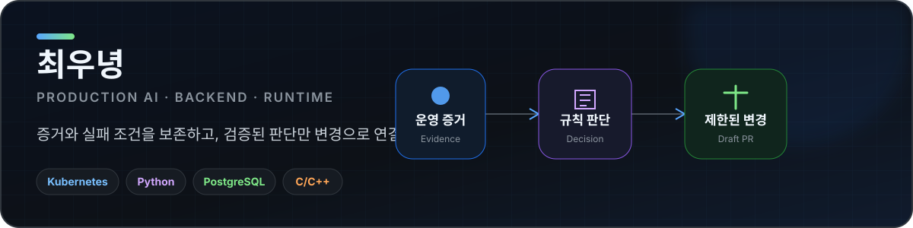
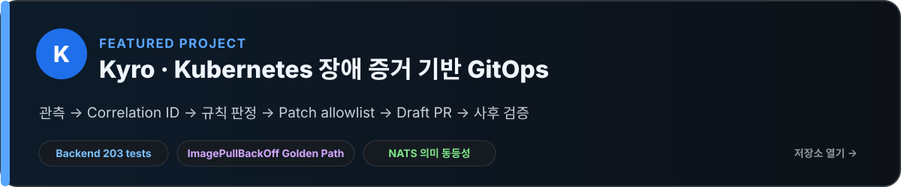
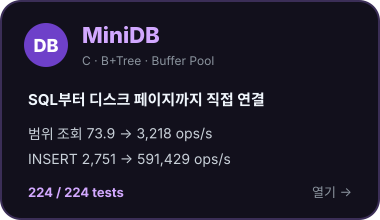
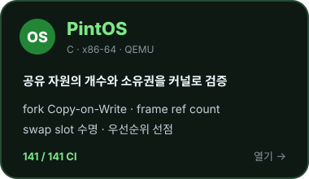
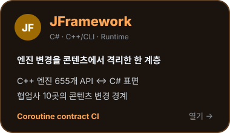

  

  
  

## 대표 프로젝트

  <a href="https://github.com/woonyong-kr/k8s-ops/blob/main/docs/GOLDEN-PATH.md">Golden Path</a> ·
  <a href="https://github.com/woonyong-kr/k8s-ops/blob/main/src/services/ai/agent/pipeline/causes.py">RCA 규칙 코드</a> ·
  <a href="https://github.com/woonyong-kr/k8s-ops/blob/main/tests/test_golden_path_safety_contracts.py">안전 계약 테스트</a> ·
  <a href="https://github.com/woonyong-kr/k8s-ops/actions/workflows/ci.yml">CI</a>

  
<strong>문제와 설계 판단</strong>

   

| 문제 | 설계 판단 | 검증 범위 |
|---|---|---|
| 관측·판정·변경·사후 검증이 서로 다른 도구에 분산 | 하나의 Correlation ID로 연결하고 단계별 실패 원인 보존 | Backend **203 tests**, frontend typecheck·lint·vitest·build |
| 자동화가 잘못된 변경을 직접 실행할 위험 | read-only agent, versioned rule, patch allowlist, Draft PR 강제 | Helm/RBAC 검사, in-process·NATS 이벤트 의미 동등성 |
| 재시도로 같은 사건과 PR이 중복될 가능성 | incident identity와 멱등성 계약, base SHA 재확인 | `make demo`로 ImagePullBackOff 한 경로 재현 |

**5인 팀 팀장** · 전체 아키텍처 · 장애 파이프라인 · 서비스 간 인터페이스 설계 · 종료 후 Golden Path 축소와 안전 계약 감사

## 시스템 구현

  
  
  

  <a href="https://github.com/woonyong-kr/minidb/blob/main/docs/benchmark-postgres.md">MiniDB 벤치마크</a> ·
  <a href="https://github.com/woonyong-kr/pintos/actions/workflows/ci.yml">PintOS 141/141 CI</a> ·
  <a href="https://github.com/woonyong-kr/dx_framework#코드-지도">JFramework 코드 지도</a>

## 최근 작업

<!-- recent_work:start -->
- **PintOS** · [fix: 실제 우선순위 선점 / 141개 회귀 검증 / checkout v6](https://github.com/woonyong-kr/pintos/commit/ea154f87730d9d3ac492bb234166382ca3531493) · 2026-08-03
- **JFramework** · [test: 코루틴 계약 / 독립 실행 / CI 게이트](https://github.com/woonyong-kr/dx_framework/commit/78c917a276b69c8746dcfb73c08803f698798ab9) · 2026-08-03
- **MiniDB** · [build: sanitizer 선택 / 224개 테스트 / CI 게이트](https://github.com/woonyong-kr/minidb/commit/7b7c43ff93e350a8feecc6d049d4e8e2828937bc) · 2026-08-03
- **Kyro** · [fix: 평가로 찾은 규칙 판별 결함 5건 개선](https://github.com/woonyong-kr/k8s-ops/commit/8c9e546fece4345fbac01c07c3d71f49c9b1da46) · 2026-08-01
<!-- recent_work:end -->

프로젝트별 역할·한계·재현 조건은 각 저장소 README에 명시. 최근 작업은 GitHub Actions가 실제 커밋 링크만 주 1회 갱신.
