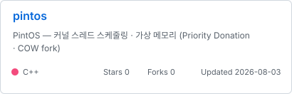
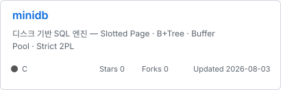
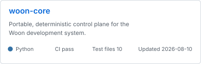
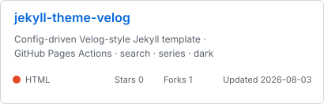
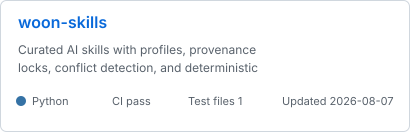
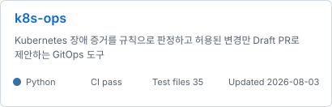

<!-- profile_intro:start -->
# 최우녕

**프로덕션 AI · 런타임 아키텍처 · 쿠버네티스 · 데이터베이스 · 운영체제 · C#/C++**

[블로그](https://woonyong-kr.github.io/#/blog) · [이메일](mailto:woonyong.kr@gmail.com)
<!-- profile_intro:end -->

## 지난 12개월

<!-- activity_summary:start -->

<!-- activity_summary:end -->

## 사용 기술

<!-- technologies:start -->

<!-- technologies:end -->

## 대표 저장소

<!-- project_cards:start -->
자동 선발 · 공개 증거 순위: 본인 커밋 25 · CI 25 · 테스트 구조 15 · 문서 10 · 최근 유지보수 10 · 메타데이터 10 · 공개 반응 5

  
  
   
  
  
   
  
  

<!-- project_cards:end -->

## 검증 상태

<!-- ci_status:start -->
<table width="100%">
  <thead>
    <tr>
      <th align="left">저장소</th>
      <th align="left">기술 범위</th>
      <th align="left">CI</th>
      <th align="right">테스트 파일</th>
      <th align="right">최근 검증</th>
      <th align="right">라이선스</th>
    </tr>
  </thead>
  <tbody>
    <tr>
      <td><a href="https://github.com/woonyong-kr/pintos">pintos</a></td>
      <td>C++ · copy-on-write · operating-system</td>
      <td></td>
      <td align="right">490</td>
      <td align="right">2026-08-04</td>
      <td align="right">—</td>
    </tr>
    <tr>
      <td><a href="https://github.com/woonyong-kr/minidb">minidb</a></td>
      <td>C · b-plus-tree · database</td>
      <td></td>
      <td align="right">5</td>
      <td align="right">2026-08-03</td>
      <td align="right">—</td>
    </tr>
    <tr>
      <td><a href="https://github.com/woonyong-kr/woon-core">woon-core</a></td>
      <td>Python</td>
      <td></td>
      <td align="right">10</td>
      <td align="right">2026-08-10</td>
      <td align="right">MIT</td>
    </tr>
    <tr>
      <td><a href="https://github.com/woonyong-kr/jekyll-theme-velog">jekyll-theme-velog</a></td>
      <td>HTML · github-pages · jekyll-theme</td>
      <td></td>
      <td align="right">0</td>
      <td align="right">2026-08-03</td>
      <td align="right">MIT</td>
    </tr>
    <tr>
      <td><a href="https://github.com/woonyong-kr/woon-skills">woon-skills</a></td>
      <td>Python</td>
      <td></td>
      <td align="right">1</td>
      <td align="right">2026-08-10</td>
      <td align="right">—</td>
    </tr>
    <tr>
      <td><a href="https://github.com/woonyong-kr/k8s-ops">k8s-ops</a></td>
      <td>Python · fastapi · gitops</td>
      <td></td>
      <td align="right">35</td>
      <td align="right">2026-08-03</td>
      <td align="right">—</td>
    </tr>
  </tbody>
</table>
<!-- ci_status:end -->

## 최근 공개 작업

<!-- recent_work:start -->
- **woon-core** · [feat: 지식 병합 판정을 해시 기반으로 압축](https://github.com/woonyong-kr/woon-core/commit/51f11b8a4eeb2c62aed8f46c9d26e4153c8be7f6) · 2026-08-10
- **woon-core** · [perf: 지식 병합 문맥과 중복 판정 최적화](https://github.com/woonyong-kr/woon-core/commit/33a8d8f113978b9fbf4fb56e465bceac41906674) · 2026-08-10
- **woon-core** · [feat: 지식 검색 부분 일치 보강](https://github.com/woonyong-kr/woon-core/commit/d79aa5a8ca8b4e81f8e004703005a595d2f2ed0a) · 2026-08-10
- **woon-core** · [fix: 퇴역 지식 검색 제외](https://github.com/woonyong-kr/woon-core/commit/5440bc5a68e4bc120d173a9531efec3b89d982df) · 2026-08-10
- **woon-core** · [perf: 지식 검색 최신성 검사 최적화](https://github.com/woonyong-kr/woon-core/commit/881e91a77ecf9694bb4bd0c3c67e02eca5cc41b7) · 2026-08-10
- **woon-core** · [fix: 지식 병합의 하위 절 삽입을 지원](https://github.com/woonyong-kr/woon-core/commit/d9e696e926d5f8db75b42a620c2affc149226b7c) · 2026-08-10
<!-- recent_work:end -->

## 외부 저장소 기여

<!-- collaboration:start -->
- **Jungle-303-04/demo-game** · [fix: pin working admission toggle console](https://github.com/Jungle-303-04/demo-game/pull/22) · 2026-07-25
- **Jungle-303-04/demo-game** · [[복구] api-server - 로비 replicas 원복 PR](https://github.com/Jungle-303-04/demo-game/pull/21) · 2026-07-24
- **Jungle-303-04/demo-game** · [perf: 게임 파드 예약량 / 게임 노드 용량 / 스케줄링 여유](https://github.com/Jungle-303-04/demo-game/pull/20) · 2026-07-24
- **Jungle-303-04/final** · [fix: AI 입력창 고정 / 패널 스크롤 경계 / viewport 높이](https://github.com/Jungle-303-04/final/pull/662) · 2026-07-24
- **Jungle-303-04/final** · [파드 상세 원인 표시와 사이드 패널 UX 통합](https://github.com/Jungle-303-04/final/pull/661) · 2026-07-24
- **Jungle-303-04/final** · [fix: 위험 파드 클릭을 리소스 상세로 연결](https://github.com/Jungle-303-04/final/pull/660) · 2026-07-24
<!-- collaboration:end -->

## 최근 글

<!-- recent_posts:start -->
- **프로젝트 · AWS · Kubernetes** · [서비스 47개의 값은 청구서에 적혀 있었다](https://woonyong-kr.github.io/#/posts/cost-postmortem) · 2026-08-02 아키텍처 결정을 AWS 청구서와 대조한 비용 회고
- **회고** · [정글에 온 이유를 묻길래](https://woonyong-kr.github.io/#/posts/jungle-interview) · 2026-08-02 크래프톤 정글 공식 채널 인터뷰 — 스타트업 임원 출신 89년생 정글러
- **프로젝트 · Unity · C#** · [게임 세 개의 기록](https://woonyong-kr.github.io/#/posts/game-projects) · 2026-08-02 스토어에 남은 두 건과 내부에서 끝난 한 건, 리드로서의 기록
- **회고** · [열 개 회사의 소스를 한곳으로](https://woonyong-kr.github.io/#/posts/source-integration) · 2026-08-02 각자 고치던 엔진을 중앙 관리로 모으고 PM 이 된 과정
- **프로젝트 · C++** · [655개 함수와 열 개 회사 사이](https://woonyong-kr.github.io/#/posts/cli-proxy) · 2026-08-02 C++/CLI 프록시로 엔진과 콘텐츠의 경계를 고정한 기록
- **프로젝트 · C#** · [엔진 위에 올린 C# 한 겹](https://woonyong-kr.github.io/#/posts/jengine-layer) · 2026-08-02 액터 생명주기 · 코루틴 · 이벤트 시스템을 C# 로 직접 만든 기록
<!-- recent_posts:end -->
